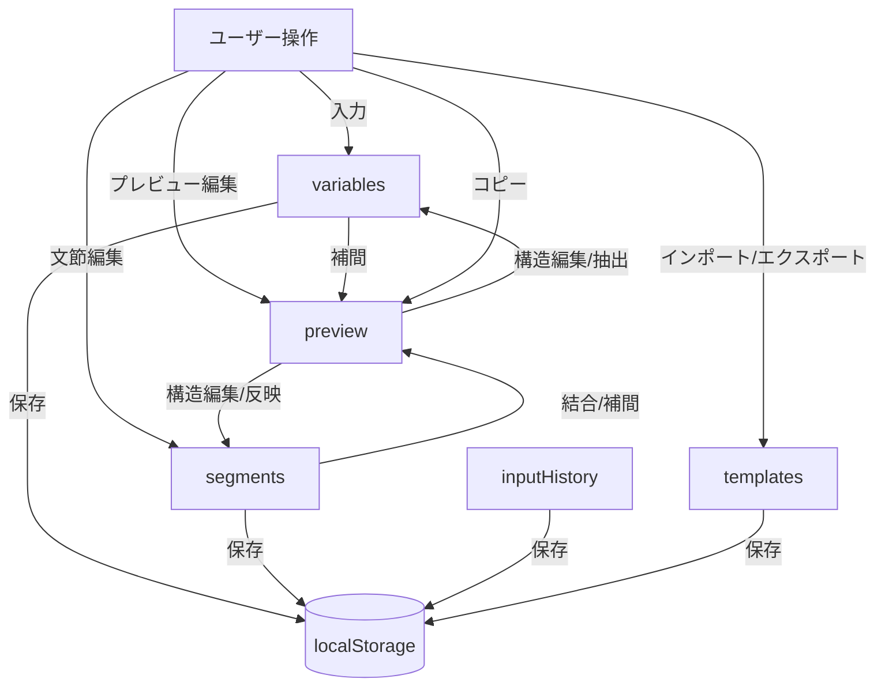
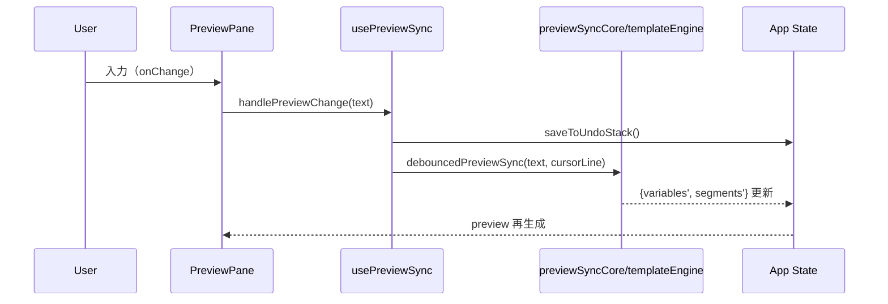

# 仕様抽出（コードベースからの詳細）

本ドキュメントは、現行コードから抽出した仕様の要点を、機能領域ごとに整理したものです。UIの用語は画面表記に準拠します。

## 1. 状態・データ永続化
- ロード/保存: `Hooks.useLocalStorage`
  - LocalStorageキー: `telescribeAssistData`
  - 保存対象: `variables, segments, sessionHistory, templates, inputHistory`
  - 変更のたびに自動保存（`App.jsx`の`useEffect`）。
- テーマ: `Hooks.useTheme`
  - LocalStorageキー: `telescribeAssistTheme`
  - `<html>` に `theme-light` クラス付与/削除でライト/ダーク切替。

## 2. 変数システム
- 型: `text`, `time`, `phone`
- 時刻型 (`Components.TimeInput`)
  - フォーマット: `YYYY, MM, DD, HH, mm, ss` の組合せ。プリセット/カスタム。
  - 丸め: `enabled:boolean`, `unit:1|5|10|15|30|60`, `method:'floor'|'round'|'ceil'`（`Utils.dateUtils.formatDateTime`）。
  - UI: ±分調整、現在時刻リロード、詳細設定モーダル、10分超差分のリロード推奨ハイライト。
  - `formatMode: 'preset'|'custom'` を採用し、カスタム入力の安定化。
- 電話型 (`Components.PhoneInput`, `Utils.phoneUtils`)
  - 入力は数字のみ保持、Blur時に日本の電話番号ルールで自動ハイフン。
  - 緑Chip: グループ補完候補を曖昧検索し上位3件、完全一致時は非表示（Phoneは数字のみで一致判定）。
- テキスト型 (`Components.VariableInput`)
  - Blur時に履歴へコミット可能。クリアボタン搭載。
- 変数候補/コミット: `TemplateUtils.extractVariableNames` により `{{ name }}` を抽出し、自動追加・完全同期を実施。
- 変数使用状況: `Utils.variablesAnalysis.analyzeVariableUsage` で未使用/使用中を算出。削除時の影響評価を提供。

## 3. セグメント（文節）
- 並び替え: `Hooks.useDragDrop`（SortableJS）
  - ハンドル: `[data-drag-handle]`, アニメーション150ms。
- 編集: `Components.SegmentItem` + `AutocompleteInput`
  - 入力オーバーレイで `{{...}}` トークンをハイライト。
  - 候補: テンプレ/履歴/変数（`{{` 後に変数補完）。
  - クリアボタン搭載。
- 末尾追加/削除/更新で `saveToUndoStack()` を先行呼出ししUndo一貫化。

## 4. プレビューと双方向同期
- 表示/編集: `Components.PreviewPane`
  - `{{...}}` をハイライトするオーバーレイ（HTMLエスケープ+スクロール同期）。
  - コピーは明示ボタンのみ（ドロップダウンの形式選択は削除済み）。
- 同期フロー: `Hooks.usePreviewSync`
  - 300msデバウンス、カーソル位置保存/復元、循環更新防止。
  - 構造編集（Enter/Backspace/Delete）は `Utils.templateEngine`/`Utils.previewSyncCore` によるテンプレ境界ベースの安全編集を適用。
  - 変数含む行の編集では、変数値抽出・更新を行い、セグメントテンプレートは保持。

## 5. テンプレート
- 管理: `TemplateManagerModal`, `SaveBlockTemplateModal`
  - 文節テンプレート（単文節）/ブロックテンプレート（複数文節）。
  - ブロック適用: 末尾追加（未登録変数は自動追加）/全置換（テンプレ出現名に完全同期）。
  - 自動ブロック選択: `Hooks.useAutoSelectBlock` が、文節配列と完全一致するブロックを自動選択（DDL未選択時）。

## 6. 差分整列・変更可視化
- `Hooks.useDiffStatus` + `Utils.diffUtils`
  - 類似性ベースのLCS整列（LCSubstring>=2で類似判定）。
  - `segmentChangeStatus: 'new'|'edited'|null` と `deletionMarkers:number[]` を算出。
  - `window.__telescribe_hasUnsavedChanges()` により未保存変更の有無を提供。

## 7. 履歴
- セッション履歴: `SessionSidebar`
  - 保存契機: 「全体コピー」押下時（重複は先頭のtimestamp更新）。最大50件。
  - お気に入り/通常のタブ切替、相対時刻表示、適用前の確認ダイアログ。
- 入力履歴/グループ履歴: `Hooks.useGroupSuggestions` + LocalStorage
  - 変数ごとの値履歴、valueGroups（最大200）。コピー/Blur時に保存。
- Undo/Redo: `Hooks.useUndoRedo`
  - 文節/変数の編集・追加・削除・並び替え・テンプレ適用・プレビュー編集などに対応。保存の一貫化済み。

## 8. データ入出力
- エクスポート/インポート: `Services.dataService`
  - エクスポート: 全体（all）/ ブロックのみ（blocks）。
  - インポート: `importDataWithModeAsync(fileOrEvent, mode, current, setters)`
    - mode: `'overwrite'|'merge'`
    - exportType自動判定（blocks/all）。
    - JSON詳細検証（型・必須項目）。
    - マージ仕様: 変数はname upsert、セグメントは末尾追加、templates.segmentはユニーク和集合、blockはname upsert、履歴は集合+ID一意化、valueGroupsは最新順200件。
  - 旧`importData`/`importDataWithMode`は削除（UI通知はアプリ側のトーストで実施）。
- コピー: `copyToClipboard(preview, format)`
  - 'plain'|'markdown'|'html' を受け付けるが、UIは形式選択を廃止しボタンで実行（通知はトースト）。

## 9. UI/UX・スタイル
- レスポンシブ: 1カラム切替、サイドバーのモバイルドロワー、バックドロップ。
- テーマ: ライト/ダーク切替、起動前適用でFOUC防止、ライト用の上書きCSS（スクロールバー含む）。
- 共通ダイアログ: `UIDialogs` による alert/confirm の統一UI（非同期API）。
- トースト: 上部中央に表示、重複タイマ管理。

## 10. 既存仕様との差分ポイント（主な更新）
- コピー形式ドロップダウンの削除（明示ボタン化）。
- テンプレ適用の仕様明文化（未登録変数の自動追加/完全同期）。
- プレビュー編集の構造編集をテンプレ境界ベースに統一、カーソル維持強化。
- セッション履歴: 重複排除・お気に入り・タブ・相対時刻。
- 変数型に `phone` を追加。履歴サジェスト/グループ補完を導入。

## 付録: 主要データフロー（概念）

