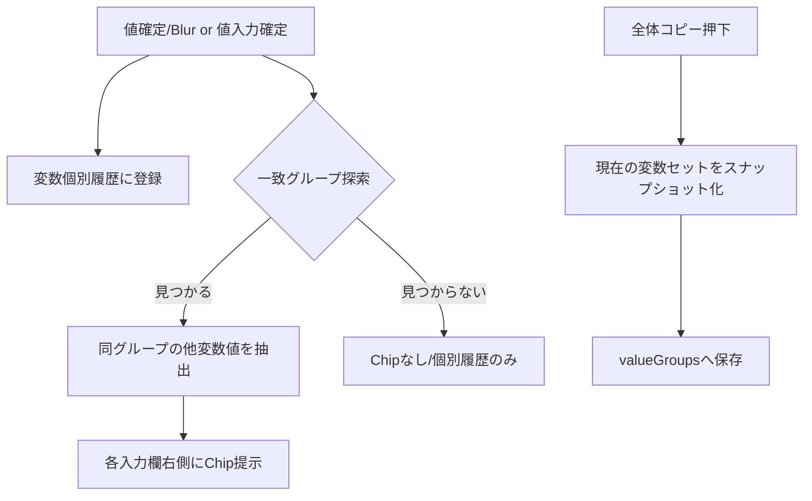
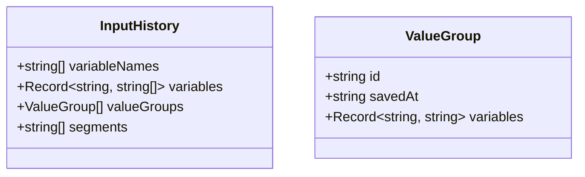

## TeleScribe Assist 詳細設計: 基本情報（変数）の履歴・サジェスト機能

### 目的
- 変数名・値の入力支援を強化し、過去セッションからの知見を再利用して入力コストを最小化する。
- 「全体コピー押下」をトリガとして、当時の変数セットをグループ履歴として保存し、将来の入力時に関連値をワンクリック適用できるようにする。

### スコープ
- 変数名のサジェスト（新規作成時）
- 変数値のサジェスト（編集時）
- グループ補完（同一保存グループからの関連変数値をChipで提示）
- データの保存/読み込み/エクスポート/インポートへの統合

---

## ユースケース
- UC1: 新しい変数を追加する際、過去に使用した変数名が候補に出る（既に存在する名前は除外）。
- UC2: 既存変数の値を入力する際、その変数名で過去に入力した値が候補に出る。
- UC3: 「全体コピー押下」で保存されたグループを、別セッションで利用。任意の変数に値を入力（もしくは候補から選択）したとき、最新の一致グループから他の変数の値をChipで提示し、ワンクリックで反映。

---

## データモデル
ローカルストレージ `telescribeAssistData.inputHistory` を拡張。

```ts
type InputHistory = {
  variableNames: string[]; // 使用済みの変数名（重複なし・ソート任意）
  variables: Record<string, string[]>; // 変数名ごとの値履歴（重複なし・新しい順）
  valueGroups: Array<{
    id: string;                // グループID
    savedAt: string;           // ISO日時
    variables: Record<string, string>; // 変数名→値 のスナップショット
  }>;
  segments: string[]; // 既存（文節用履歴）
}
```

初期値（後方互換）:
- 既存の `INITIAL_INPUT_HISTORY` が `{ variables: {}, segments: [] }` の場合、初回アクセス時に `variableNames: [], valueGroups: []` を補完。

保存ポリシー（上限は下記の確定事項を参照）:
- `variableNames`: 新規変数名を追記。既存は重複排除。
- `variables[name]`: 最新が先頭。重複排除。空文字は原則保存しない。
- `valueGroups`: 「全体コピー押下」時に現在の `variables` 配列を {name: value} に完全スナップショットとして保存。空文字も含め、当時の文字列をそのまま保存する。

---

## 保存トリガ
- T1: 変数名の新規作成時 → `variableNames` に登録。
- T2: 各変数の値変更確定時（Blur 等）→ `variables[name]` に履歴を登録。
- T3: 「全体コピー押下」→ `valueGroups` にスナップショットを保存。
 - T4: Chipクリックで値を反映した直後 → `variables[name]` にも履歴を登録（コミット）し、グループ候補も再計算。

---

## 一致・正規化ルール
値の一致判定は「完全一致（正規化なし）」とする。
- text/phone/time いずれも、保存された表示文字列と完全一致で照合。

一致検索（グループ連関）:
- ある変数Aに値vを入力/確定した時、`valueGroups` を新しい順に走査し、Aの値が完全一致する最新グループを特定。
- 特定グループに含まれる他の変数名Bの値を、Bの入力欄の右半分Chipとして提示。

---

## UI仕様
### 変数追加モーダル（`VariableModal`）
- 変数名入力フィールドにサジェストドロップダウンを追加。
- 候補は `inputHistory.variableNames` から、既に存在する変数名を除外し、曖昧検索（部分一致＋サブシーケンスの簡易スコアリング）で抽出。

### 変数入力（`VariableInput`/`PhoneInput`/`TimeInput`）
- 右側にChip候補領域（右半分）を追加。左側は従来のInput領域（通常入力可能）。
- Chipの表示条件:
  - 対象変数名での値履歴（`inputHistory.variables[name]`）を最大N件表示（新しい順）。
  - さらにグループ補完候補（現在のセッションで確定済みの値に基づく）を先頭に1件表示（緑系トーン、薄め）。
- Chipクリックで対象フィールドに値を即時反映（onChange）。

レイヤリング/操作:
- Chip群は右半分に `absolute` 配置。背景は `pointer-events-none`、各Chip自体は `pointer-events-auto`。
- 右端の既存ボタン（クリア等）と干渉しないよう、Chip領域に右側余白（例: `pr-4`）を確保し、`z-index` を適切に設定。

除外条件:
- time型変数は本履歴・サジェスト機能の対象外（値履歴表示・グループ補完Chipともに非表示）。ただし、グループ保存（valueGroups）には含める。

視覚デザイン（Tailwind想定・Outlineボタン風）:
- 通常履歴Chip: `px-2 py-0.5 text-xs bg-transparent border border-gray-400/50 text-gray-300 hover:bg-gray-400/10 rounded`。
- グループ補完Chip: `px-2 py-0.5 text-xs bg-transparent border border-emerald-400/60 text-emerald-300 hover:bg-emerald-400/10 rounded`。

アクセシビリティ:
- Chip はボタン要素でキーボード操作可能。`aria-label` で内容と反映対象を明示。

---

## アルゴリズム詳細
### グループ補完候補の算出
入力/確定イベント（値が確定した変数名を `name0`、値を `value0` とする）:
1. `value0` をそのまま用い、`valueGroups` を新しい順に走査。
2. `group.variables[name0]` と完全一致で比較し、一致する最初のグループ `G` を選ぶ（最新1件のみ）。
3. `G` に含まれる他の変数 `nameX` の値 `valueX` を候補化。
4. 各 `nameX` について、現在の入力欄にChipを提示。クリック時に `valueX` をそのまま反映（型ごとの逆正規化は不要: 表示値を格納）すると同時に、履歴コミット（T4）を実行。

優先順位:
- もっとも新しい一致グループを1件採用。将来的な拡張で「頻度」や「複数候補」も検討可能。

### 値履歴の更新
- 各変数のBlur時に、入力値をそのまま `variables[name]` の先頭に追加（重複は先頭へ移動）。空文字は原則保存しない。

---

## データ入出力
### 保存
- 既存の `useLocalStorage.saveData` にて `inputHistory` を含めて一体保存（後方互換を維持）。
 - `valueGroups` 保存時は、直前に保存したグループとスナップショットが完全一致する場合はスキップ（重複抑止）。

### エクスポート/インポート
- 既存の `DataService.exportData`/`importDataWithMode` を拡張:
  - 検証: `inputHistory.variableNames` は文字列配列、`valueGroups` は配列+shape をバリデート。
  - マージ: `variableNames` は和集合、`variables[name]` はユニーク和集合（新規を末尾追加でも可）、`valueGroups` は時系列結合後に新しい順ソート（id重複は排除）。

---

## 状態・API 変更案（親 `App.jsx`）
- state: 既存 `inputHistory` を拡張型で保持。
- 「全体コピー押下」ハンドラで `valueGroups` への追記を実施。
- 変数値更新（`VariablesPanel.onUpdate` 経由）時に履歴とグループ候補の計算を実施、各 `VariableInput` へ `suggestChips` を props 供給。

簡易インターフェース案:
```ts
// App 内
const [inputHistory, setInputHistory] = useState<InputHistory>(...);

// 値履歴登録
function commitVariableValue(name: string, value: string, type: 'text'|'phone'|'time') { /* そのまま push（完全一致） */ }

// グループ保存
function saveValueGroupFromCurrent(variables: Array<{name:string, value:string}>) { /* snapshot 保存 */ }

// 補完候補の解決
function resolveGroupSuggestions(committed: {name:string, value:string, type:string}): Record<string, string|null> { /* name→候補値 */ }
```

---

## 図解




---

## バリデーション・制約
- 文字列長の上限（例: 値=400文字、変数名=50文字）。
- 履歴上限（確定）:
  - 変数名: 最大 200
  - 値履歴: 各変数あたり 最大 50
  - グループ: 最大 200
- 保存除外: 空文字、テンプレ固定語（要ルール化）
 - 変数名変更時の履歴: 変更後は別変数として扱う（旧名の履歴を移行しない）。

---

## パフォーマンス
- 一致グループ探索は最新順で早期終了。グループ上限により O(N) で十分高速。
- 比較は完全一致のため、追加の正規化処理は不要。


---

## 既存コードへの変更ポイント（実装指針）
- `Constants.INITIAL_INPUT_HISTORY` を拡張初期化に対応。
- `DataService._validateImportedData`/`importDataWithMode` を `variableNames`/`valueGroups` 対応に拡張。
- `App.jsx`
  - 「全体コピー押下」で `valueGroups` 保存処理を追加。
  - 値確定時の履歴保存・グループ候補算出関数を用意し、`VariableInput` 系へ props 供給。
- `VariableModal.jsx` に名前サジェストを追加。
 - `VariableInput.jsx`/`PhoneInput.jsx`/`TimeInput.jsx` にChip領域と受け口を追加（time型は表示しない）。
 - `helpers.js` に曖昧検索/履歴上限ユーティリティを追加。

---

## 確定事項（ユーザー回答反映）
- 履歴上限: 変数名=200、値履歴/変数=50、グループ=200（提案採用）
- グループ一致: 最新1件のみ採用
- グループ保存: 空文字も含めて完全スナップショット保存
- 時刻型フォーマット: 取り扱いなし（無視）。値は保存文字列をそのまま扱う。
- 対象除外: time型変数は履歴・サジェスト・Chip表示の対象外（グループ保存には含める）
- Chip適用範囲: 該当フィールドのみ反映
- 変数名サジェスト: 曖昧検索（部分一致＋サブシーケンスの簡易スコアリング）

---

## 検証観点（受け入れ条件）
- 新規変数追加時に過去の変数名候補が表示され、既存の変数名は除外される。
- 変数値入力時に過去の値候補が表示され、クリックで即反映される。
- ある変数の値が入力/確定された時、過去の保存グループから一致する最新グループが見つかれば、他の変数欄にChipが提示され、クリックで反映できる。
- 「全体コピー押下」でグループ履歴が保存され、次回セッションでも再利用できる。
- エクスポート/インポート/マージで拡張された `inputHistory` が正しく維持される。

---

## 今後の拡張余地
- 頻度/重みづけによるランキング、複数一致グループの統合候補提示。
- 会社名の同義語マッピング（例: 株式会社◯◯/◯◯）による一致精度向上。
- 組織名や電話番号の正規化ルールの強化（辞書導入）。


